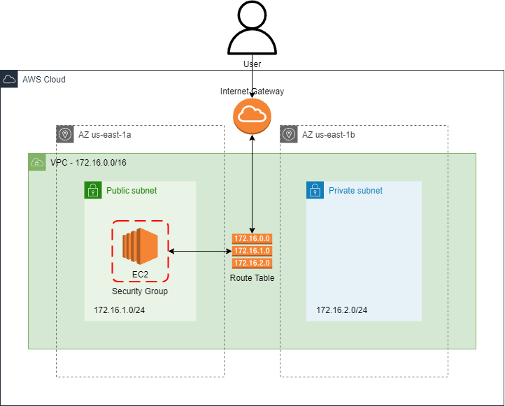

## Laboratório 01 - Arquitetura Network - Turma 31CLD
Nesse laboratório será realizado a criação de uma **VPC**, duas **Subnets** (uma publica e outra privada) em diferentes **Zonas de Disponibilidades**, um **Internet Gateway** e uma **Route Table** associados à VPC. Com a rede preparada, será criado uma instancia **EC2** com Amazon Linux 2023, atribuida a subnet publica e apenas com acesso HTTP (porta 80) liberado em seu **Security Group**.
Será usado um script Bash na VM que inicializará um servidor Web com disponibilidade de acesso HTTP.

## Arquitetura da solução
Conforme contextualizado anteriormente, esta arquitetura consiste nos seguinte serviços:
- VPC
- Subnet
- Route tables
- Internet gateways
- EC2
- Security Group

## Como rodar
Após realizar o clone do repositório na sua máquina basta executar o script **init.sh**:

    -> ./init_sh

Fique atento ao terminal, pois diversas vezes será solicitada a interação do usuário.

## Como deletar
Para realizar a deleção de todos os recursos em sua conta AWS você deve executar o script **destroy.sh**:
        
    -> ./destroy.sh

O mesmo irá solicitar uma confirmação sua, então é necessário interagir com o terminal. Abaixo temos um GIF mostrando a execução do script de destruição dos recursos.